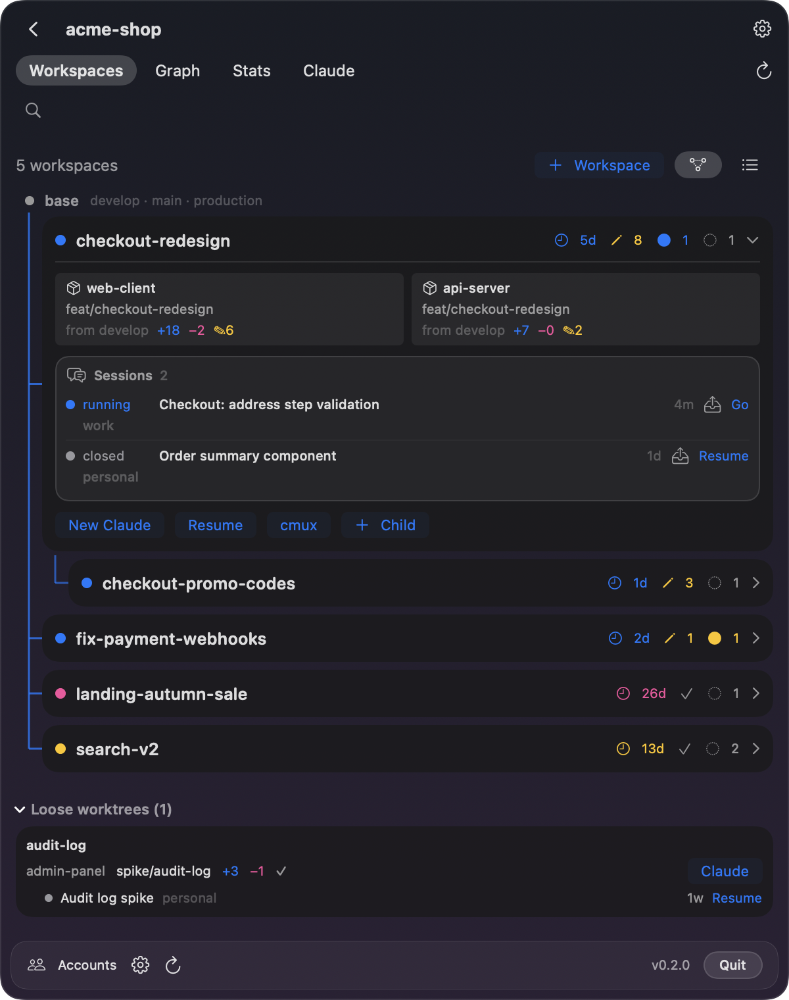
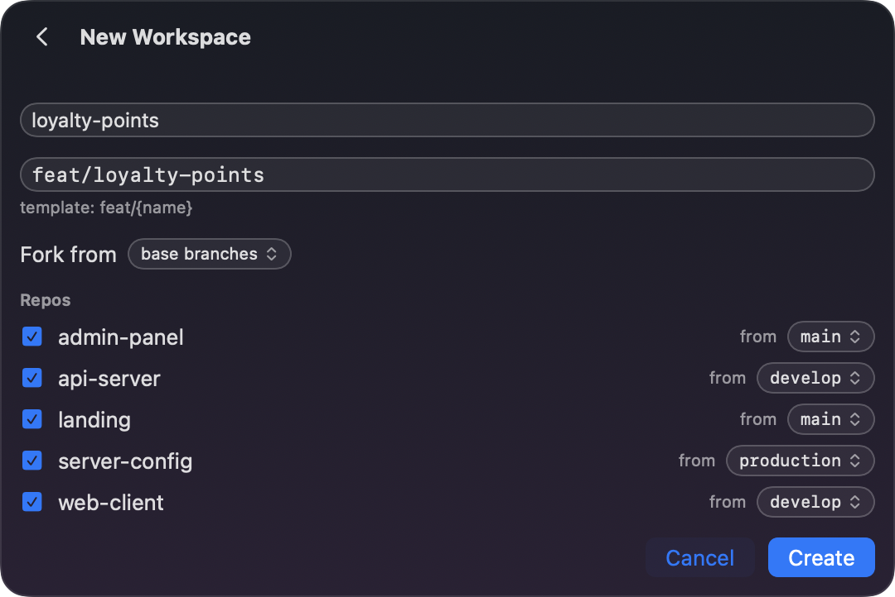
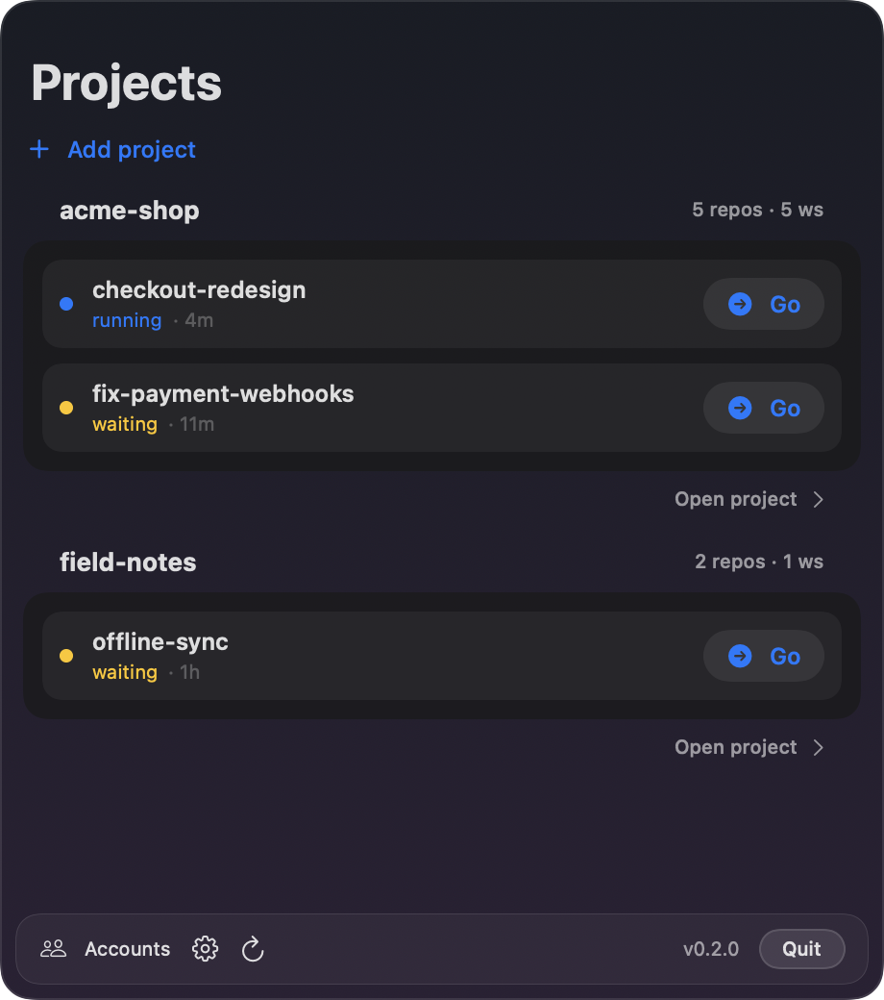
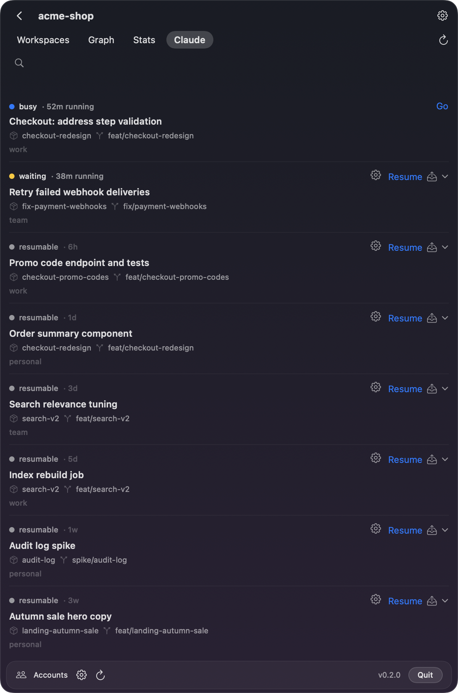
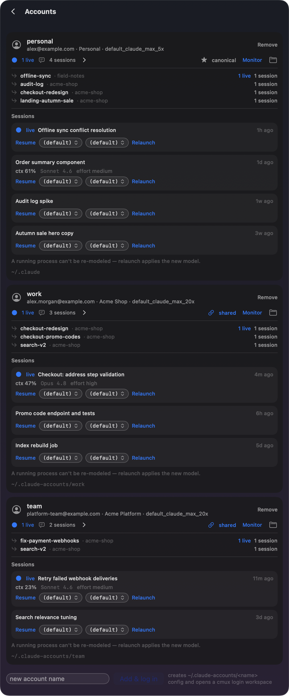
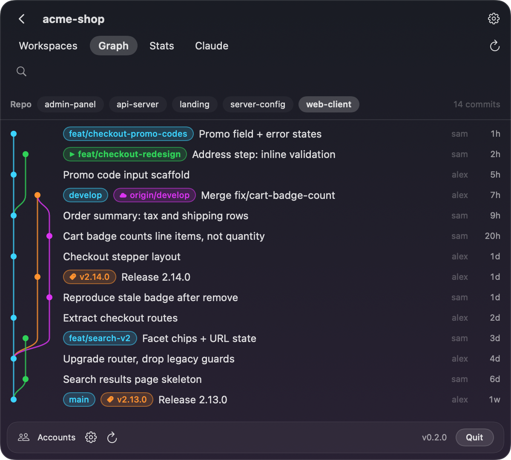
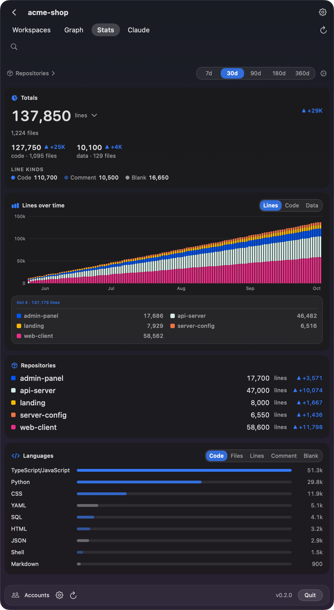
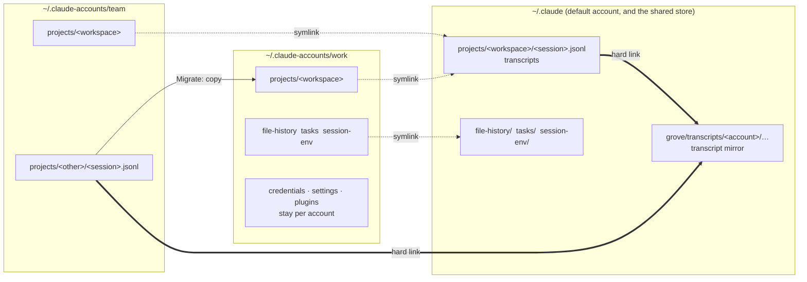

# Grove — git-worktree workspaces for parallel Claude Code sessions

A macOS menu-bar app for running [Claude Code](https://claude.com/claude-code) and other AI coding agents on a product that is split across several repositories.

Grove gives every feature its own **workspace**: one directory holding a git worktree of each repository. Claude Code starts in that directory and sees one consistent branch of the whole product, so parallel agent sessions never trip over each other's branches. Grove also moves a session from one Claude account to another when a rate limit runs out.

**[Download Grove for macOS](https://github.com/efim0v/grove/releases/latest/download/Grove.zip)** · macOS 26 or later, Apple silicon · [install notes](#install)

> **Companion app: [Brow](https://github.com/efim0v/brow).** Brow lives in the MacBook notch and shows the rate limits of every Claude account you have. Grove moves work between accounts; Brow tells you which account has room. Each runs on its own, and they are built to be used together.

<p align="center">
  
  <a href="https://github.com/efim0v/brow"></a>
</p>

All screenshots show made-up demo data.

## The problem

Claude Code works best when it can see the whole product in one directory. A monorepo gives it that. But many products are split across repositories — a client, a server, the server's configuration, an admin panel, a landing page, a handful of microservices — and merging millions of lines into one repository just for the agent is not always sensible, if only because of who should have access to what.

Run several agents in parallel on a multi-repo project and they start tripping over branches: one checks out a branch in the server repository, and another agent working on a different feature is suddenly looking at the wrong code.

## Workspaces

Grove's answer is the **workspace**: an umbrella directory for one feature or epic that contains a git worktree of each repository you chose, all on the same branch.

```
~/Workspaces/acme-shop/checkout-redesign/      <- start Claude Code here
├── web-client/     worktree on feat/checkout-redesign
├── api-server/     worktree on feat/checkout-redesign
└── server-config/  worktree on feat/checkout-redesign
```

Claude Code is launched in the umbrella directory. It gets what is in effect a private copy of the whole project on that feature's branch, and nothing another session does can change the branch under it. Ten features in flight are ten directories.

Creating one takes a name and a click: Grove runs `git worktree add` in each repository, applies your branch template, seeds shared files such as `CLAUDE.md`, and runs post-create hooks. Workspaces can be stacked — forked from another workspace rather than from the base branch — and Grove derives that tree from git itself.

<p align="center">
  
  
</p>

## Moving a session between accounts

The second thing Grove is for. A project does not have to stay on the account it started on: when one account runs out of limit, continue the same session on another.

- **Resume as…** continues a session under a different account without copying anything.
- **Migrate to…** makes a full copy of a session in another account — transcript, memory, file history, tasks — and works even while that account is in use.
- **Share** moves a session into the shared store so every linked account can see it.

Each project has a default account, and every launch can pick its own account, model and effort.

<p align="center">
  
  
</p>

## Graph and statistics

- **Graph** — the commit graph of a repository with its branches, remotes and tags. From a branch you can create a workspace or open Claude Code in its worktree.
- **Stats** — lines of code across the project: totals, language breakdown, and growth over time stacked by repository.

<p align="center">
  
  
</p>

There is also a command-line tool, `grove`, with `scan`, `workspaces`, `sessions`, `create`, `graph` and `doctor`, each with `--json`.

## How Grove and Brow fit together

Claude Code keeps each account in its own directory: `~/.claude` for the default account and, here, `~/.claude-accounts/<name>` for the others. Both apps read those directories; neither talks to the other directly.



**The shared store (symbolic links).** There is no separate neutral directory: the default account's own `~/.claude` is the shared store. When an account is linked — by a button on the Accounts screen, or the first time you resume a session as another account — its `file-history`, `tasks` and `session-env` directories become symbolic links into `~/.claude`, and so does `projects/<workspace>` for each workspace involved. From then on a session started under one linked account is visible to the others, which is what makes **Resume as…** work without copying. Credentials, settings and plugins are never shared.

**The transcript mirror (hard links).** Separately, Grove keeps a safety copy of every transcript under `~/.claude/grove/transcripts/`. Each entry is a hard link to the live file, so it costs no extra disk space while the original exists. If a transcript disappears from an account, the next pass restores it. Entries are kept for 90 days and up to 500 MB by default; **Purge** on the Sessions screen is the way to delete a transcript for good.

**Migration (copy).** **Migrate to…** copies a session's data from one account directory into another.

The other contracts between the two apps — the account key that names Keychain items and browser profiles, the browser router Grove borrows from an installed Brow, the status-line captures both read — are described in [`docs/grove-and-brow.md`](docs/grove-and-brow.md).

## What Grove does on your machine

Worth knowing before you run it:

- **Grove edits each account's `settings.json`**, pointing `statusLine.command` at its own wrapper so it can read usage per session. It does this at launch.
- **Linking an account moves its session files into `~/.claude`.** Anything that would be overwritten is backed up under `<account>/grove-backup/` first.
- **A transcript deleted by hand comes back** while the mirror is on. Use Purge.
- **Grove does not read Claude Code's credentials.** Rate limits and sign-in are Brow's job.

This is an independent tool, not affiliated with or endorsed by Anthropic.

## Requirements

- macOS 26 or later.
- Xcode with Swift 6.2, to build.
- [Claude Code](https://claude.com/claude-code) and git.
- [cmux](https://cmux.dev). Grove starts and resumes sessions in cmux terminals; there is no other launch path.
- For cross-account resume and the transcript mirror: an account signed in at the default `~/.claude`.
- Optional: [Brow](https://github.com/efim0v/brow), for per-account rate limits and for opening each account's sign-in in its own browser profile. When Brow is installed, Grove passes its browser router to every session it launches.

## Install

Download **[Grove.zip](https://github.com/efim0v/grove/releases/latest/download/Grove.zip)** from the [latest release](https://github.com/efim0v/grove/releases/latest), unzip it and move `Grove.app` to `/Applications`.

The build is signed ad hoc and is not notarized by Apple, so macOS blocks the first launch. Open **System Settings → Privacy & Security**, find the message about Grove and press **Open Anyway** — or clear the quarantine flag yourself:

```sh
xattr -dr com.apple.quarantine /Applications/Grove.app
```

First run: click the tree icon in the menu bar, open Settings, press **Add project…** and pick the directory that contains your repositories. Workspaces are created under `~/Workspaces/<project>/<name>` unless you change the template.

The release also has `grove-cli.zip`, the command-line tool, and `SHA256SUMS.txt` to check the downloads against.

## Build

```sh
git clone https://github.com/efim0v/grove.git
cd grove

swift test                 # full suite, about two minutes
Scripts/build-app.sh       # -> dist/Grove.app
cp -R dist/Grove.app /Applications/
```

The app is signed ad hoc by default. macOS then forgets the Automation permission on every rebuild; to keep it, set `GROVE_SIGN_IDENTITY` to your own `Apple Development: Name (TEAMID)` identity before building.

The command-line tool:

```sh
swift build -c release
.build/release/grove --help
.build/release/grove workspaces ~/code/acme-shop
```

If cmux reports as unavailable, see [`docs/troubleshooting.md`](docs/troubleshooting.md).

## Layout

| Path | What it is |
|---|---|
| `Sources/GroveCore` | The core library: git and worktrees, cmux, Claude sessions, the shared store, the transcript mirror, migration, code statistics, credentials and usage. Brow depends on it too. |
| `Sources/GroveAppKit`, `Sources/GroveApp` | The menu-bar app |
| `Sources/grove-cli` | The `grove` command-line tool |
| `Tests` | About 920 tests |
| `docs` | How Grove and Brow fit together, snapshot testing, troubleshooting |

There are no third-party dependencies.

## Development

- `swift test` and `swift test -c release` should both stay green.
- `swift run GroveApp --snapshot /tmp/grove-snap` renders the app's screens to PNG without starting it; see [`docs/snapshot-testing.md`](docs/snapshot-testing.md).
- The screenshots in this README are regenerated with
  `DEMO_SCREENSHOTS_DIR="$PWD/docs/screenshots" swift test --filter DemoScreenshotTests`.
- Grove's configuration lives at `~/Library/Application Support/Grove/config.json`.

## License

[GNU GPL v3](LICENSE). Version 0.2.0 and earlier were released under the MIT License.
